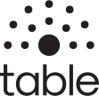

# table

__The docs are not meant to be viewed as plain .md files inside this repo.__

Please open the hosted pages: *links coming soon*

or serve the docs folder via a local webserver.

Docs are made with docsify. You can serve them via `docsify serve docs`.

---

* official repo: https://github.com/progmem64/tableapp
* docs: link coming soon

## General Information

_table_ (talk about lecture) is a platform that can be used during or between lectures. It covers Q&A, Live-Q&A, feedback submission (audience to lecturer) and can be used for discussing certain topics. It is designed to separate content into events/lectures. Due to the reason it can handle multiple events/lecture at the same time, a single instance is enough for the whole university. _table_ also integrates with the universities authentication service (further integration is planned). The system was developed in the course of a bachelor thesis for use at the TU-Clausthal.

## Features

* **Q&A:** Users can ask questions and other user can respond to question.
* **Live-Q&A:** Users can ask question and the lecturer can review (and respond to) questions during the lecture.
* **Feedback submission:** Everyone can submit feedback in any form (for the lecturer or others).
* **Voting:** Users can up/downvote content (questions, feedback, comments, …).
* **Bookmark:** Users can bookmark entries (question, feedback, …) to look at them later on.
* _(Planned: ) **Follow:** Users can follow entries to get notifications if something happens._
* **Visual context:** Users can attach images to their entries and comments to provide visual context. During a lecture the lecturer can submit screenshots of the presentation-pc to the platform. These screenshots can also be used by users/students to attach them to their entries (as visual context).
* **Anonymity:** Users can select if they want to submit content anonymously.
* **Roles:** Users can have "roles" attached to their name. This can be helpful for users to identify certain persons (like Lecturer, Instructor, Tutor) and rate their contents quality.

## Documentation State

Code-Docs for containers/components are missing atm but they should be self-documenting for devs.

Documentation will be added, as soon as these containers/components were restructured. (Look at the todos in the repo-README).